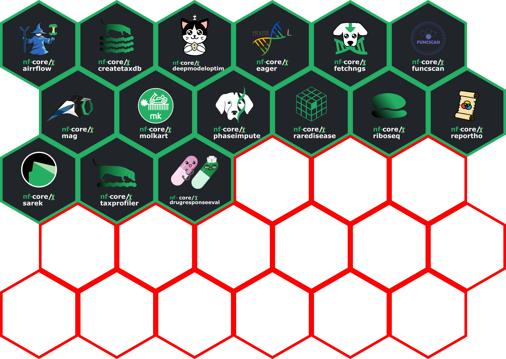

#  

A repository for hosting files containing the official [`nf-core` logos, icons, and images](nf-core-logos) in `ai`, `png` and `svg` formats, along with instructions on how to download an `nf-core` logo for your pipeline.

## Download a pipeline logo

From `nf-core/tools v1.7` the pipeline logo in `.png` format will be automatically downloaded and added to the appropriate directories when you run the [`nf-core pipelines create`](https://nf-co.re/docs/tutorials/adding_a_pipeline/creating_a_pipeline) command!

You can also manually run the command yourself, e.g.:

```bash
nf-core pipelines create-logo <pipeline name> --format <png/svg> --theme <light/dark> --width <pixels>
```

## Font information

If you are as meticulous as we are and would like to use the same fonts and colours for other purposes then you can download [Maven Pro Bold Fonts](https://fonts.google.com/specimen/Maven+Pro) via you web-browser and install them locally, or if you are running the script in a Linux environment you should be able to do this with the following commands:

```bash
mkdir -p ~/.fonts/
cd ~/.fonts/
wget 'https://raw.githubusercontent.com/google/fonts/master/ofl/mavenpro/static/MavenPro-Black.ttf'
wget 'https://raw.githubusercontent.com/google/fonts/master/ofl/mavenpro/static/MavenPro-Bold.ttf'
wget 'https://raw.githubusercontent.com/google/fonts/master/ofl/mavenpro/static/MavenPro-Medium.ttf'
wget 'https://raw.githubusercontent.com/google/fonts/master/ofl/mavenpro/static/MavenPro-Regular.ttf'
```

The green colour in the logo is RGB: `36,176,100` or Hex:`#24B064`.

## Pipeline logo specifications

This repository also includes pipeline logos that have been customised away from the default generated pipeline to include pipeline specific badges, icons etc..

The specifications of the PNG versions of the dark and light versions of each should be:

- Height: 4cm
- Resolution: 300 DPI

## Merchandise

This repository also hosts various images used for non-standard logos and other merchandise on the [nf-core/shop](https://nf-co.re/shop).

Raster resolution of these images should be 300dpi and saved in a 'colour safe' format.

These are included in this repository to act as a backup but also help coordinate between the nf-core team for uploading between the different shop fronts.

When uploading to the respective spreadshirt store fronts, make sure the default nf-core logo remains at the top of the shop homepage.

To do this:

1. Left sidebar: Sales channels (Verkäufskanale) > nf-core
2. Left sidebar (Einstellung): Pages (Seiten) > Product list (Produktliste)
3. Left sidebar: Sort designs (Designs sortieren) > Select anything before 'nf-core logo - dark background) > Move to 'Unten' > Press saave (top bar)

## Hexagon Stickers

This repository contains a template and 'official' nf-core pipeline hexagon sticker designs.



The official hex stickers are made for pipelines that have a pipeline specific icon or brandmark in addition to the 'official' nf-core logo (i.e., wordmark plus nf-core apple).
The follow the official hexagon 'Sticker Standards' as defined [here](https://sticker.how/).

To use the template:

- Make sure your pipeline's icon/brandmark is in SVG (vector) format before starting!
- Copy the `nf-core-TEMPLATE-logo-hex-dark.svg` in a folder withe the pipeline name, and rename the file to: `nfcore-<pipelinename>-logo-hex-dark.svg`, e.g. `sarek/nfcore-sarek-logo-hex-dark.svg`
- Open the new file in a vector graphics editor (e.g. Inkscape)
- Turn on guides (View -> Guides, or <kbd>ctrl</kbd> + <kbd>|</kbd>)
- Update the wordmark
  - Replace the 'logohere' text to the pipeline name.
  - Horizontal center align the entire nf-core logo relative to the background hex object
  - The text height should fit in red box, and/or the between the lower guides (the guides or top and bottom of the red box corresponds to the top of the lower-case letters of 'core' and the bottom of the lower case leters of 'here', respectively)
  - In case the logo text is too long (i.e. runs off or touchs the green border of the hexagon), you can scale the text down to fit the hexagon
  - Vertical center align the logo wordmark (plus apple) inside the red box
  - Once text updated, and size and location adjusted, delete the red box
- Insert the pipeline icon/brandmark
  - Copy the pipeline icon/brandmark SVG file into the hexagon template
  - Rescale the icon so the majority of the icon fits within one of either the width or height limits of the red circle or guides, and/or the center point of the icon is in the center point of the circle/guides
  - It is OK to adjust away from these guidelines to make the icon looks 'optically' centred
  - Note that the entire icon does NOT need to fit entirely within the red circle; 'sticky out bits' may fall outside the circle or guides (or, e.g., be wider if the height is no bigger than the guides). The circle acts as a rough size example
  - Horizontal center align the icon relative to the background hexagon object
  - Vertical center align the icon relative to red square
  - Once icon is in place, delete the red circle
- Verify the size of the entire hexagon is 5.08cm height x 4.39cm width (e.g. in Inkscape with both: Object > Transform > Scale ; Document Properties > Display > Front Page)
- Export the image as a PNG with a resolution of 300 DPI, with the same name replacing the suffix with `.png`.
- Copy your new SVG into the next free space (deleting the red placeholder) in the `nf-core-hexagon-sticker-preview.svg` file,
  - Export at 300 DPI as a PNG with the same name replacing the suffix with `.png`.
  - Keep the file size as horizontal A4!

For printing, to ensure that the hexagon sticker will be be compatible with other hexagon stickers, the following specifications should be followed (as per the 'official hexagon' '[Sticker Standards](https://sticker.how/)'):

- Height: 5.08 cm / 2in
- Width: 4.39 cm / 1.73in

For printing as a square, this would be 5.08cm x 5.08cm / 2in x 2in.

## Help

If you have any questions or issues please send us a message on [Slack](https://nf-co.re/join/slack).
